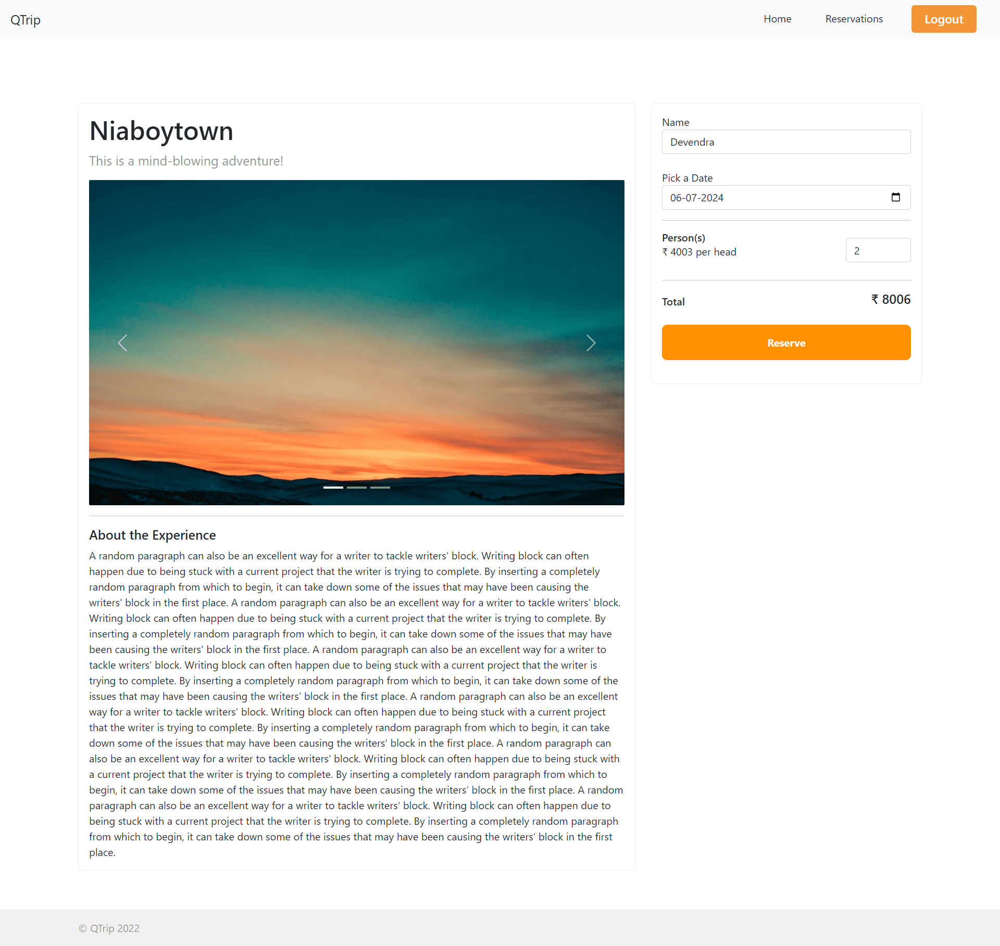
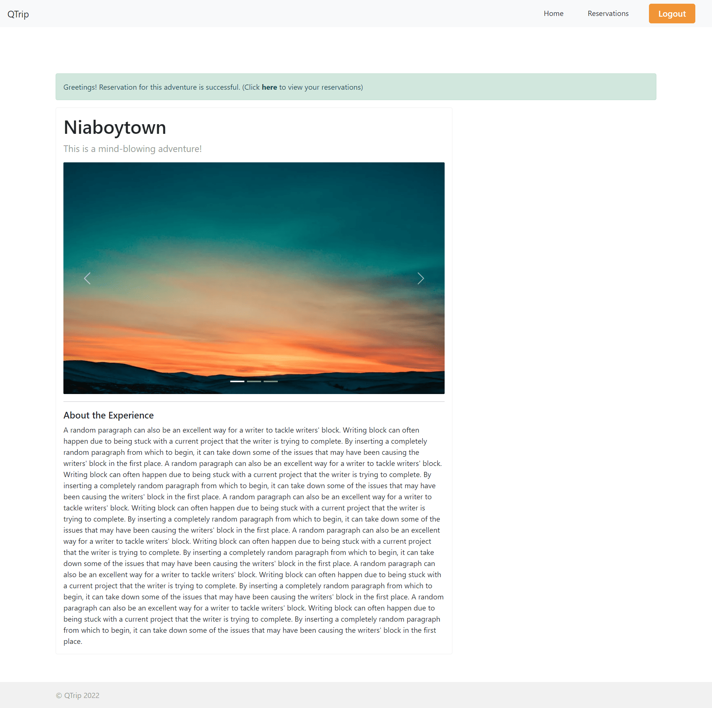
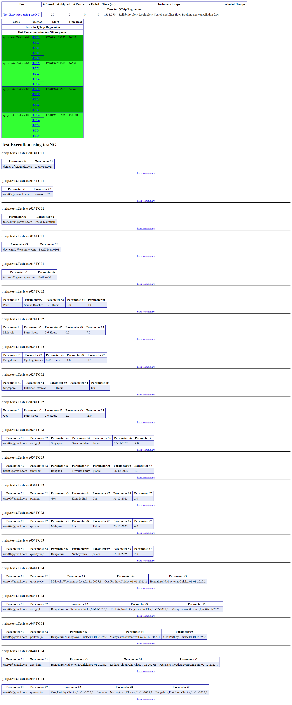
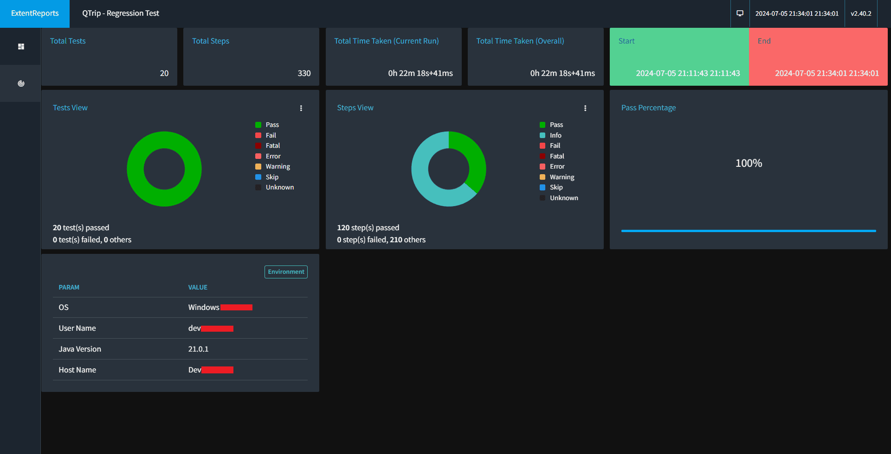

# QTrip

`Java` `Selenium` `Locators` `HTML` `Developer Tools` `XPath` `TestNG` `Test Case Design` `Page Object Model` `Wrapper Methods` `Extent Reports`

---

The application under test is [QTrip](https://qtripdynamic-qa-frontend.vercel.app), a travel website.

---

During the course of this project:
* Designed and automated 4+ test cases following Page Object Model design pattern using Page Factory, Selenium and TestNG.
* Utilized Apache POI in each test to accept dynamic test data.
* Created a TestNG project for easily running automated test cases.
* Implemented Singleton pattern for initializing WedDriver to make effective use of resources.
* Generated customized test reports for the TestNG project using Extent Reports.

---

# Overview

The application under test is [QTrip](https://qtripdynamic-qa-frontend.vercel.app), a travel website.

During the course of this project:
* Designed and automated 4+ test cases following Page Object Model design pattern using Page Factory, Selenium and TestNG.
* Utilized Apache POI in each test to accept dynamic test data.
* Created a TestNG project for easily running automated test cases.
* Implemented Singleton pattern for initializing WedDriver to make effective use of resources.
* Generated customized test reports for the TestNG project using Extent Reports.

---

# Explore QTrip and create TestNG project
## Scope of Work
* Executed all the important user flows in QTrip manually to understand the application.
* Analyzed the test cases to be automated.
* Defined pages and corresponding actions to convert the manual test cases to automation scripts using the Page object model.

## Skills used
`Page Object Model` `Test Case Design` `Java` `Selenium` `TestNG` `XPath`

---

# Automate QTrip test cases with TestNG
## Scope of work
* Automated four different test cases to test the working of the QTrip Application.
* Populated sheets for Data driven testing using Apache POI.
* Grouped test cases into functional groups to execute the test cases in custom sequence.

## Skills used
`Java` `Selenium` `Locators` `HTML` `Developer Tools` `TestNG` `Page Object Model` `XPath`

---

# Generate customized test reports for TestNG project
## Scope of work
* Enhanced inbuilt selenium methods with added functionality.
* Implemented Wrapper methods for screenshots and retry mechanisms.
* Generated customized test reports using Extent Reports.

## Skills used
`Extent Reports` `Wrapper Methods`

---

# Screenshots
## Application

> qtrip home page

> qtrip login page

> qtrip register page

> qtrip user logged in page

> qtrip adventures page

> qtrip adventures detail page

> qtrip adventures detail page after reservation

> qtrip adventures reservations page

## Reports
### Emailable report

> qtrip emailable report

### Index report

> qtrip index report

### Extent report

> qtrip extent report